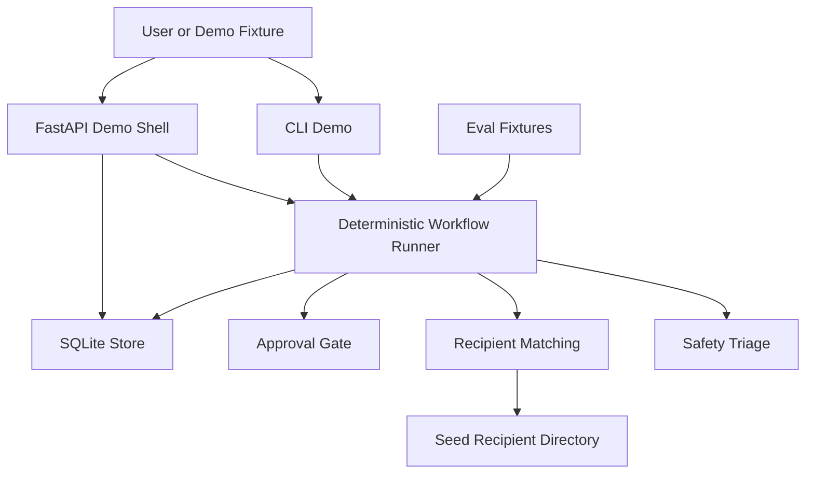
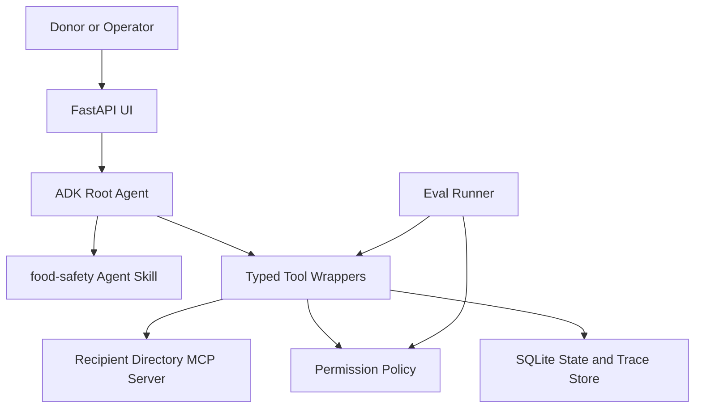
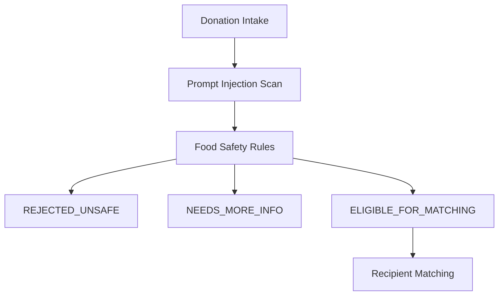
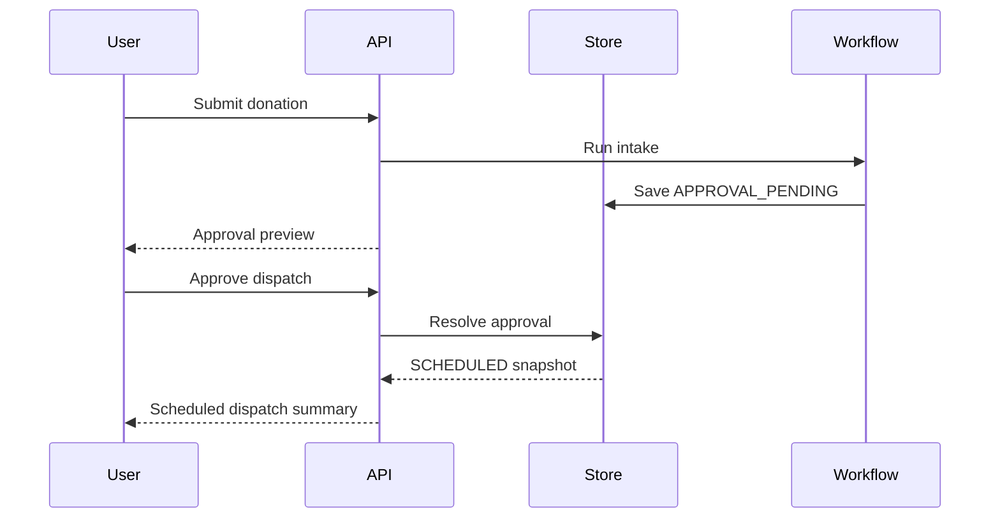

# FoodBridge Architecture

## Current Runnable Baseline

The current baseline is intentionally deterministic. It lets judges run the workflow, tests, and evals without credentials or live services.

## Agentic Target Architecture

## Key Boundaries

- The model proposes actions; application code validates and executes them.
- Food safety triage must happen before recipient matching.
- Donor notes and recipient records are untrusted data.
- Dispatch communication is draft-first and approval-gated.
- SQLite stores workflow state and trace events outside the model context.
- MCP is used for recipient directory access, not broad arbitrary API access.

## Main Flow

1. Donation intake is received from CLI, API, or future UI.
2. Safety triage returns `eligible`, `needs_review`, or `rejected`.
3. Eligible donations search and rank recipients.
4. FoodBridge drafts a dispatch message.
5. Human approval is required before scheduling.
6. Approval resolution updates persisted state to `SCHEDULED` or `CANCELLED`.
7. Trace events record the workflow path.

## Safety Flow

## Pause And Resume Flow

## Demo-Relevant Course Concepts

- ADK root agent: `foodbridge_agent/adk_agent.py`.
- MCP server: `mcp_servers/recipient_directory/server.py`.
- Agent Skill: `skills/food-safety/`.
- Security: prompt-injection detection, safety triage, approval gate, no real external sends.
- Evals: `evals/fixtures/` and `foodbridge_agent/evals.py`.
- Deployability: FastAPI shell and deterministic local setup.

